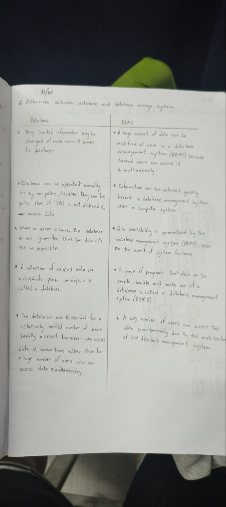
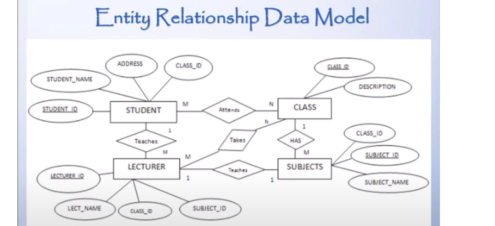

### Topic : Database Users and Database Adminstrators
---
## Introduction to Database Systems
- This journal is a reflection of my journey into understanding database systems.
- This approach has made my learning experience more meaningful and grounded, so here I begin.
 -  So I learned the lessons in understanding Database Systems and why they are important in managing data and I also learned that data is simply a collection of facts, but when structured and stored properly in a database.
 
- One example was the college registration process.Untill now, it involves physical forms, bank deposits, and scattered Excel sheets, which can lead to inefficiencies such as data redundancy, inconsistency, and difficulty in accessing information. 
- A database system could centralize everything, ensuring better security, accuracy, and accessibility for anytime acess.
-  One important point that stood out was the problems with traditional file-processing systems. Before databases, organizations used physical files and spreadsheets to store data, which often led to:

    Data redundancy – The same information stored in multiple places, leading to wasted space.
    Inconsistency – If data was updated in one place but not in another, errors could arise.
    Security issues – Physical files can be lost, stolen, or accessed by unauthorized people.
    Difficulty in accessing data – Searching through thousands of files manually is time-consuming.
 - On the other hand, a Database Management System (DBMS) brings so many advantages:

   Centralized data storage – Everything is stored in one place, making access easy.
    Better security – Only authorized users can access sensitive data.
    Improved efficiency – Data retrieval, updates, and transactions happen in seconds.
    Scalability – As an organization grows, the database can expand with it.

- We also discussed the evolution of database systems and how different industries—like banking, social media, sales, and navigation—use them to handle vast amounts of valuable data.

 The phrase “Data is the new gold” stood out to me because it highlights the importance of managing data effectively in today’s digital world and to be honesst it was like a new thing for me since i did not think about it in.
- In the classroom we we were asked to choose a public sector in Bhutan that could benefit from a DBMS as a class activity.
- So I scrolled and searched in the internet and found how government offices, hospitals, and financial institutions rely on accurate record-keeping and data-sharing for decision-making. 
- A proper database system can help reduce errors and actively help in productivity in the above sectors.
 - I found some intresting things about how companies like Google, Facebook, and Amazon rely on vast amounts of data to provide better services and make important business decisions, this makes me realize how crucial it is to manage data effectively and securely.
- Over all the above lessons  helped me realize the importance of databases in our daily lives. 

# Difference Between Database and DBMS  

| Database | DBMS (Database Management System) |
|------------|-----------------------------------|
| A collection of stored data. | Software that manages and interacts with the database. |
| Simply stores data in an organized way. | Helps store, retrieve, modify, and manage data efficiently. |
| Cannot process or manage data on its own. | Provides tools to search, update, secure, and organize data. |

| 
### **In Simple Terms:**  
- A **database** is just a place where data is kept.  
- A **DBMS** is the smart system that helps manage and use that data efficiently.  

## Key Learnings and Reflections

### 1. **Data Manipulation Language (DML): Simplifying Data Access**
   - **Procedural vs. Declarative DMLs**:
     - **Procedural DML**: This feels like giving someone step-by-step directions to a destination. 
     - **Declarative DML**: Is all about simplicity and focus: you describe the result you want, and the system figures out the rest. It’s like giving directions by saying, "Take me to the park," instead of explaining every turn and street along the way.
     
   - **SQL: The Power of Simplicity**:
     - SQL queries are straightforward. For example:
       ```sql
       SELECT Orders.item FROM Orders WHERE Orders.customer_id = 1;
 ```
- This single line can pull specific data from a massive database. It’s like magic!


### 2. **Database Engines: The Heart of Data Management**
 -  It handles tasks like creating, reading, updating, and deleting data (CRUD operations).
 - **Flexibility in Engines**:
     - Some databases, like MySQL let you change engines depending on our needs. Others, like PostgreSQL, come with a fixed engine.


### 3. **Inside a Database Engine**
 - **Storage Manager**:
 - This component acts as a bridge between the raw data stored on disk and the applications that need it. It’s like a librarian who knows exactly where every book is.
 - **Query Processor**:
 - This is the brain behind executing queries. It includes tools like the DDL interpreter and DML compiler, which make sense of your requests.
 - **Transaction Management**:
 - This ensures everything runs smoothly, even when multiple users are accessing the database at once. It’s like a traffic controller for data.
 - **Reflection**: Understanding these components gave me a newfound respect for database systems. They’re like well-oiled machines, with each part playing a crucial role. It’s inspiring to see how much thought goes into making technology reliable and efficient.


### 4. **Database System Architecture: Connecting the Dots**
- **Applications and Databases**:
- Applications rely on databases to store and retrieve data. They communicate through APIs, often using languages like Python, Java, or C.
- **ODBC: The Universal Translator**:
- Open Database Connectivity (ODBC) is a standard that lets applications talk to databases, no matter the programming language. It’s like a universal adapter for data.
- **Reflection**: Learning about ODBC made me appreciate the importance of standards in technology. They make it easier for different systems to work together, which is essential in today’s interconnected world.
## Personal Growth and GNH Values
- **Holistic Learning**:
- Studying database systems has been more than just technical training. It’s helped me see how technology fits into the bigger picture of society and well-being.
- **Ethical Responsibility**:
- The emphasis on data integrity and security in databases aligns with GNH values. It’s a reminder that technology should serve people, not the other way around.
- **Reflection**: This journey has been transformative. It’s not just about learning how databases work—it’s about understanding how to use technology responsibly and ethically. As I move forward, I want to create systems that are not only efficient but also aligned with the greater good.



## Conclusion
- This journal helped me learn about some new terms whcih was very important in learning about database systems and the difference between database and DBMS.From the simplicity of SQL to the complexity of database engines, each concept has added a new information in my learnings.Suporting GNH values into my learning has made the experience more meaningful, reminding me that technology is a tool for improving day to day life. As I continue to learn more I hope to carry these lessons with me, striving to create solutions that are both innovative and ethical.
